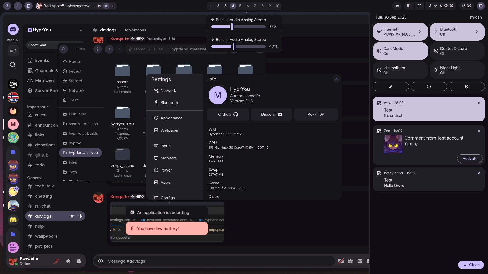

# HyprYou

> This project is not affiliated with or sponsored by Google.

HyprYou (hyprland-material-you v2). It aims to provide a modern, feature-rich, and visually appealing desktop configuration. Here are some key features:

- **Material You Colors**: The project generates colors for your apps based on you wallpapers or settings.
- **Fluid Animations**: Expect natural and fluid animations throughout the desktop experience.
- **Design**: The design wherever possible is made by [Material 3 design](https://m3.material.io/)
- **Settings**: Almost all settings are possible to configure in settings! You don't need to change hyprland.conf unless you need something specific.
- **Clean home folder**: I made everything so won't have any unnecessary files in home. And from settings you can enable configs for terminals or anything else.

## Preview

- **Demo video:** [Reddit post](https://www.reddit.com/r/unixporn/comments/1mj2p6x/hyprland_hyprland_material_you_v2_hypryou/)  
- **Screenshot:** 

> [!TIP]
> When you run HyprYou as DE session (from SDDM, Greetd, etc.) it doesn't use `~/.config/hypr/hyprland.conf`  
> For any custom variables/configs look for `~/.config/hypryou/hyprland.conf`  
> I made that so you can have different dotfiles on one system  
> If you don't have Display Manager you can use `hyprland --config /usr/share/hypryou/configs/hyprland/main.conf`

> [!NOTE]
> I'm doing everything by myself and **for free**.  
> If you want to support me, you can buy me a coffee on [**ko-fi**](https://ko-fi.com/koeqaife).

> [!NOTE]
> If you want to talk or to check devlogs go to our Discord server  
> <https://discord.gg/nCK3sh8mNU>

## Packages info

- `hypryou` - The main package, should be installed before anything else
- `hypryou-utils` - Replacement of `hypryou-qtutils`, uses gtk4 for hyprland dialogs instead of qt
- `hypryou-greeter` - Configs for greetd, so it's replacement of SDDM or anything like that. With Material 3 theme.

## How to install (Arch)

> [!TIP]
> If you have an error like "cannot resolve dependency" you should install packages that are named there with `yay` or any other AUR helpers.  
> For very new people to ArchLinux, check this: <https://itsfoss.com/install-yay-arch-linux/>  
> Also if AUR is down (it happens sometimes) you can check for Chaotic AUR: <https://aur.chaotic.cx/>  
> And if you have errors like `Config error in file /....` just try using `hyprctl reload`

    
Manual installation

- Clone repository: `git clone --depth=1 https://github.com/koeqaife/hyprland-material-you.git`
- Install all dependencies from depends.txt
- Build Cython code by using `build.sh` in `hypryou/`
- Then copy `hypryou` to `/usr/lib/hypryou` and copy `hypryou-assets` to `/usr/share/hypryou`
- Then use `build.sh` in `build`
- Move `hypryouctl`, `hypryou-start`, `hypryou-crash-dialog` to `/usr/bin`
- Copy `assets/hypryou.desktop` to `/usr/share/wayland-sessions/`
- And run it as `HyprYou` from your display manager (Not `Hyprland`!!)
- Optional:
  - You can build `hypryou-utils` or `hypryou-greeter` if you want  
    > By using `makepkg -si` in `greeter` for `hypryou-greeter` or in `hypryou-utils`

    
Automatic installation

- **Pre-built:**
  - Install needed packages from [releases](https://github.com/koeqaife/hyprland-material-you/releases)
  - Use `sudo pacman -U <file name>` change `<file name>` to name of the package you downloaded and make sure you're in Downloads folder
    > Yea some people were trying to use `pacman -U` in home folder so I had to say that

- **Build manually:**
  - `hypryou` - Use `makepkg -si`
  - `hypryou-greeter` - Use `makepkg -si` in `greeter/`
  - `hypryou-utils` - Use `makepkg -si` in `hypryou-utils/`

> Coming soon to `AUR`!

## Credits

Original project by [koeqaife](https://github.com/koeqaife/hyprland-material-you)  
Modified and packaged by [Saltyfunnel](https://github.com/Saltyfunnel)  
Includes automated installer: `install-hypryou.sh`

